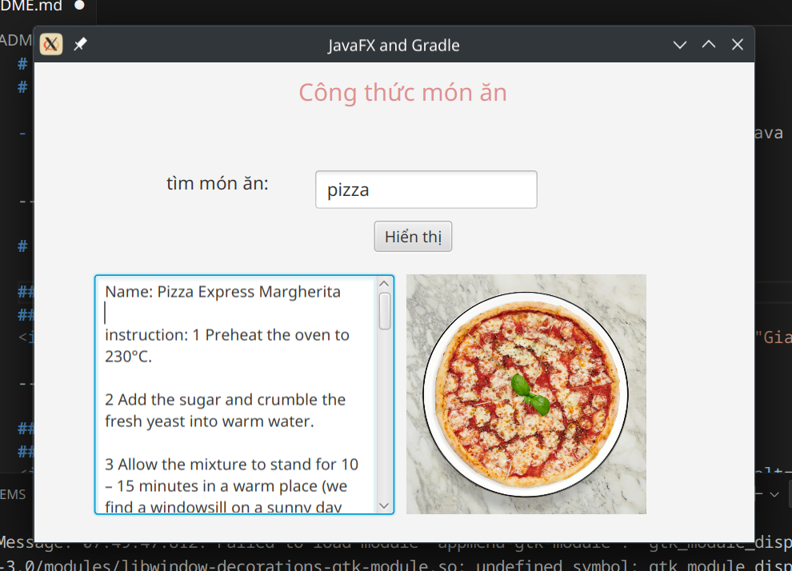
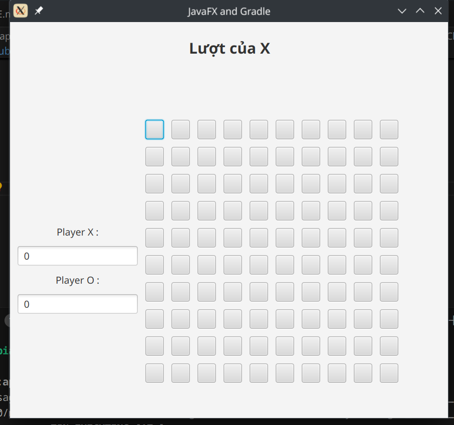
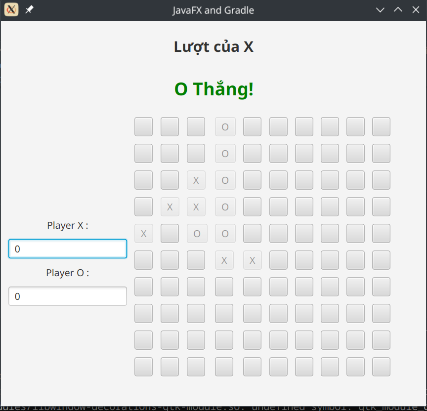
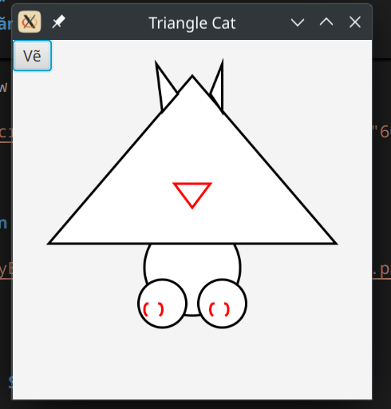
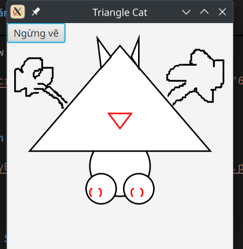
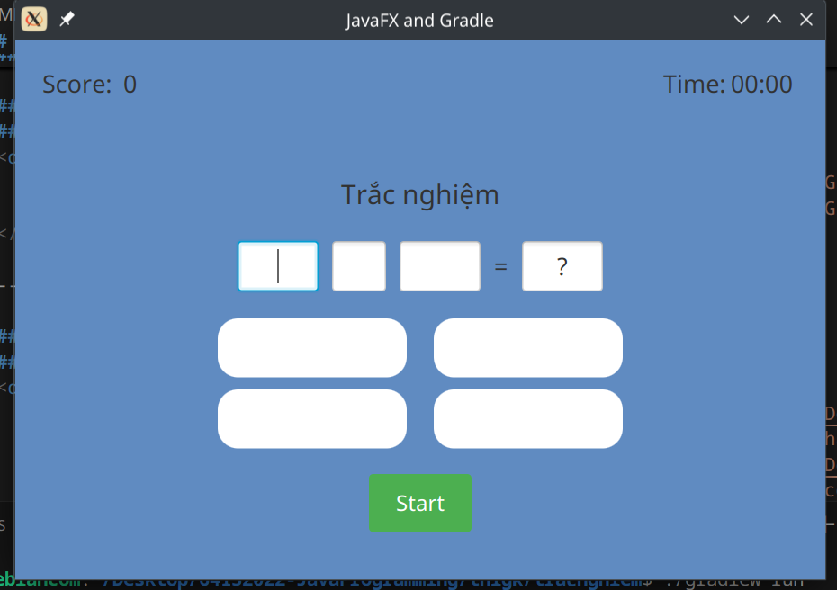
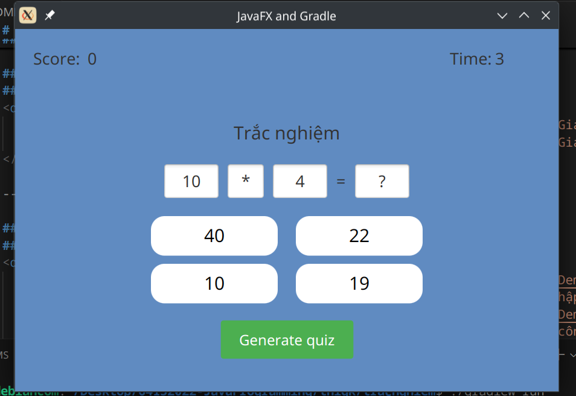
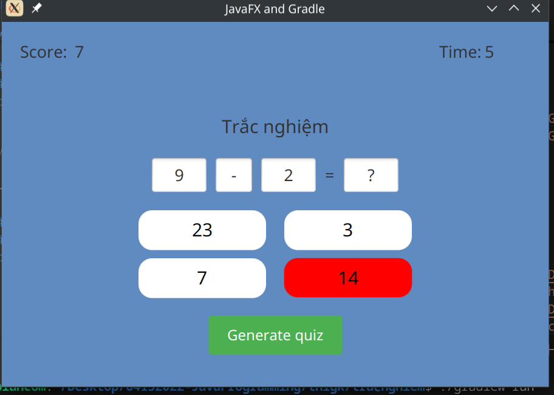
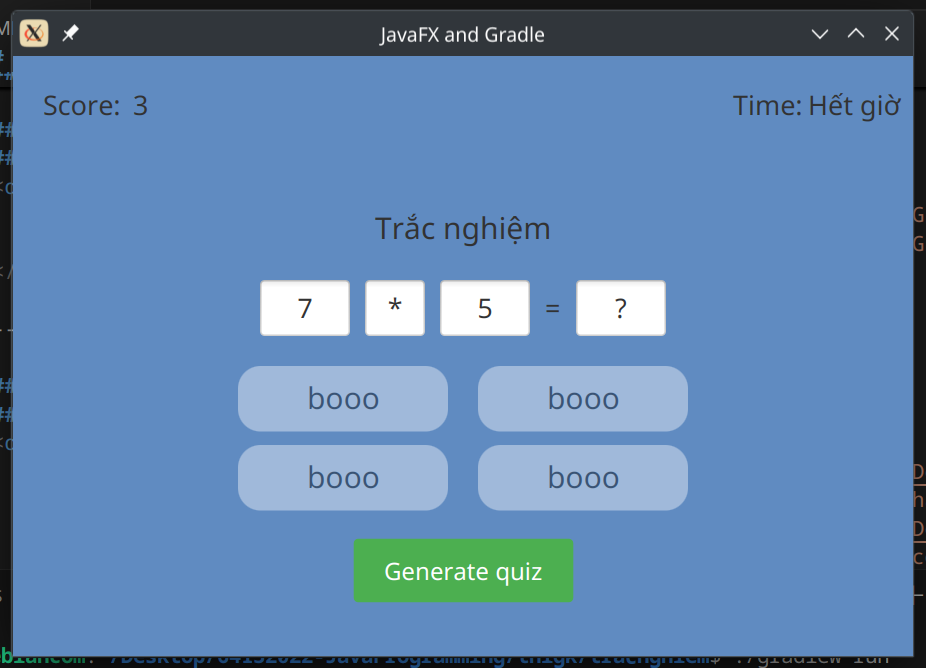

# 64132022-JavaProgramming
# **Thông tin**

- Đây là nơi lưu trữ các bài tập thực hành lớn nhỏ về môn học lập trình Java

---

#  **Bài tập Java**

## **Tìm kiếm món ăn**
### Mô tả:
- Chương trình gọi api từ https://www.themealdb.com/ để tìm kiếm món ăn
- parse json
- sử dụng ImageView javafx fxml để hiển thị ảnh
### 🔹 Giao diện:

---

## **caro 5x5**
### 🔹 Giao diện:

  
  

---

## **Làm quen với canvas trong javafx **
### 🔹 Giao diện:

  
  

---

## **Chương trình trắc nghiệm tự sinh**
### 🔹 Giao diện:

  
  
  
  
  

